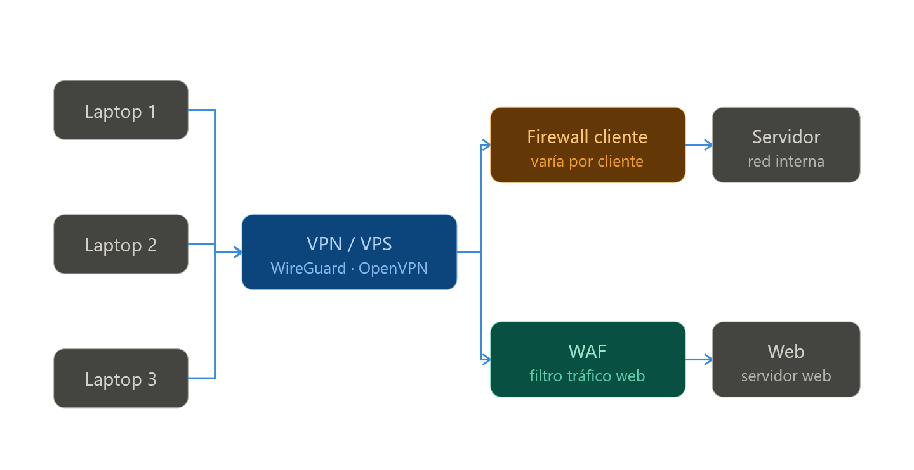

# Seccion9 — Secure Hub VPN

Solución de conectividad segura basada en **WireGuard** y **OpenVPN** para empresas. Acceso remoto Zero Trust con soporte para pfSense, OPNsense y firewalls corporativos (Cisco, Fortinet, SonicWall).

---

## Arquitectura

```
[Laptop 1] ──┐
[Laptop 2] ──┼── túnel WireGuard/OpenVPN ──► [VPS/VPN Gateway]
[Laptop 3] ──┘                                      │
                                          ┌──────────┴──────────┐
                                          │                     │
                                    [Firewall]               [WAF]
                                          │                     │
                                    [Servidor IT]         [Servidor Web]
```





| Componente | Descripción |
|---|---|
| VPS Gateway | Concentrador VPN central. WireGuard (UDP 51820) + OpenVPN (TCP 443) |
| Firewall cliente | pfSense / OPNsense / Cisco / Fortinet — varía por cliente |
| WAF | Nginx + ModSecurity + OWASP CRS |
| Servidor IT | Recursos internos del cliente |

---

## Protocolo según firewall del cliente

| Firewall del cliente | Protocolo recomendado |
|---|---|
| pfSense / OPNsense / Mikrotik | WireGuard |
| Cisco ASA / Fortinet / SonicWall | OpenVPN (TCP 443) |
| Sin firewall propio (cloud) | WireGuard |

---

## Inicio rápido

### 1. Instalar el servidor VPN
```bash
sudo bash server/install-server.sh
```

### 2. Añadir un cliente nuevo
```bash
sudo bash onboarding/add-client.sh <nombre> <clave_publica> <ip_asignada>
# Ejemplo:
sudo bash onboarding/add-client.sh moham CMvCw4g...= 10.0.0.2
```

### 3. Configurar cliente Windows
```powershell
# Ejecutar como Administrador en PowerShell
.\clients\setup-windows.ps1 -ClientAddress "10.0.0.2"
```

### 4. Configurar cliente Linux
```bash
sudo bash clients/setup-linux.sh
```

---

## Estructura del repositorio

```
├── server/
│   └── install-server.sh       # Instala WireGuard en el VPS desde cero
├── clients/
│   ├── setup-windows.ps1       # Setup automático para Windows
│   └── setup-linux.sh          # Setup automático para Linux
├── onboarding/
│   └── add-client.sh           # Registra nuevo peer en el servidor
└── docs/
    └── troubleshooting.md      # Problemas conocidos y soluciones
```

---

## Comandos de mantenimiento

```bash
# Ver peers conectados y último handshake
sudo wg show

# Reiniciar túnel
sudo wg-quick down wg0 && sudo wg-quick up wg0

# Ver logs en tiempo real
sudo journalctl -u wg-quick@wg0 -f

# Eliminar cliente
sudo wg set wg0 peer <CLAVE_PUBLICA> remove
sudo wg-quick save wg0
```

---

## ⚠️ Nota sobre proveedores cloud (Ionos, OVH, Hetzner...)

Muchos proveedores tienen un **firewall externo independiente del UFW** que bloquea el tráfico antes de llegar al sistema operativo. Hay que abrir el puerto UDP 51820 desde el **panel web del proveedor**, no solo desde UFW.

Ver [`docs/troubleshooting.md`](docs/troubleshooting.md) para el checklist completo.

---

> **Seccion9** — Conectividad segura para empresas.
> info@seccion9.com | 902 99 64 09
